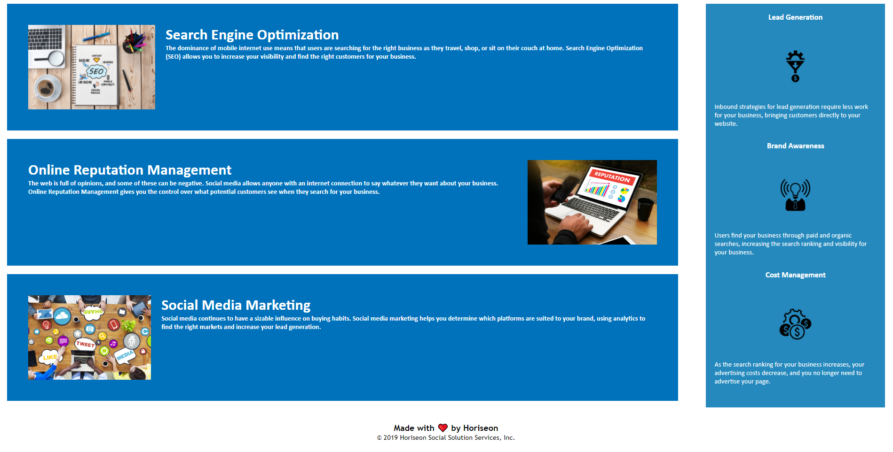

# Horiseon: Digital Marketing Services

## By Mackenzie Gray

### Technologies used

- HTML
- CSS

### Description

The motivation for this project is to provide our marketing agengy client, Horiseon, with a codebase for thier website that meets accessibility standards to ensure their site is optimised for search engines.  

Accessibility describes the practice of making a website useable for as many people as possible. This includes but is not limited to people with diabilities such as visual, hearing or cognitive impairments or people viewing the website on mobile devices and/or slow network connections. 

### Outline of changes made

Changes made to the index.html codebase include:

- Addition of a desciptive title
- Implementing the scout rule and cleaning the code provided in the codebase
- Modifying the source code provided in the codebase
- Addition of id tag "search-engine-optimization" for the figure id associated with the h2 "Search Engine Optimization"
- Addition of accessible "alt" attributes to image elements across the index.html codebase
- Commenting of sections in the index.html outlining the elements within them

Changes made to the style.css codebase include:
- Commenting of the style.css file
- CSS selectors and properties consolidated and organised to follow semantic structure

### Link to URL 

[a link](https://mdkgray.github.io/Week_1_Assignment_MDGray/)

### Screenshots 

